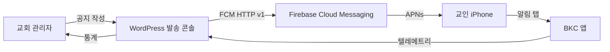
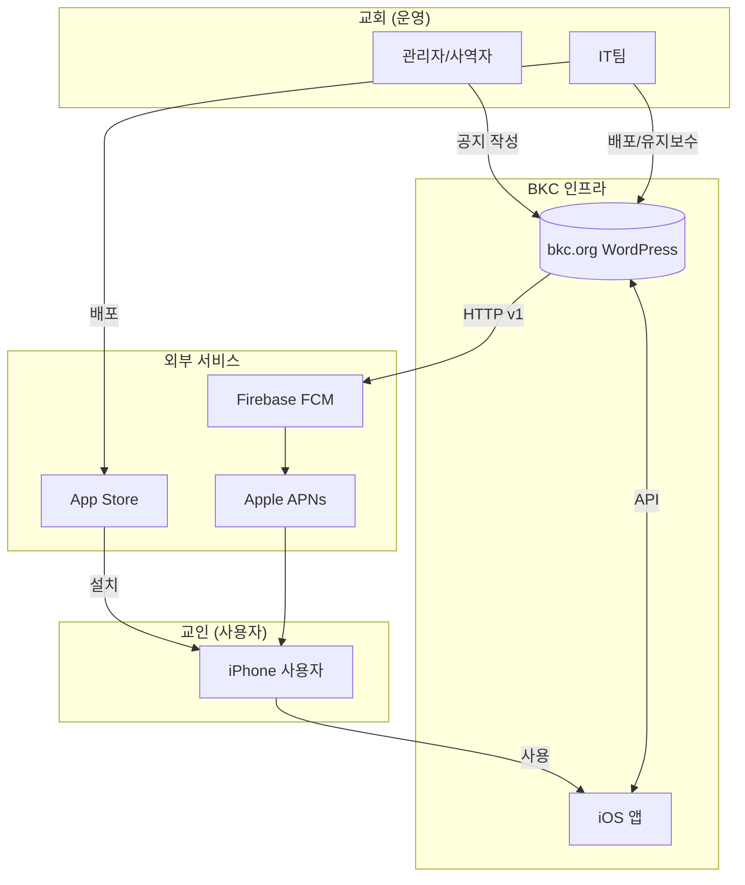

# 01. 시스템 개요

## 왜 만들었나

기존에는 카카오톡 채널을 통해 교회 공지를 발송했습니다. 문제점:

1. **종속성** — 카카오 정책 변경에 휘둘림 (요금제, 발송 규칙, 채널 검증 절차)
2. **분석 부재** — 누가 받았는지 / 열어봤는지 측정 불가
3. **그룹 타겟팅 한계** — 청년부 / 새가족 같은 세분화된 발송 어려움
4. **딥링크 부재** — 알림을 눌러도 홈으로만 이동, 특정 설교/공지로 못 보냄

## 무엇을 하는가

한 사이클은 이렇게 움직입니다:

1. 교회 관리자가 WordPress 관리자 페이지에서 **새 공지 작성** (제목 / 본문 / 그룹 선택 / 딥링크)
2. WP 플러그인이 캠페인을 큐에 넣고 → Action Scheduler가 10초 뒤 dispatcher 실행
3. Dispatcher가 FCM HTTP v1 API로 푸쉬 발송 (조건: `bkc_all` 또는 `bkc_youth || bkc_newfam` 등)
4. FCM이 APNs로 전달 → 교인 iPhone에 푸쉬 알림
5. 앱이 백그라운드에서 NSE로 `delivered` 이벤트 기록 → 사용자가 탭하면 `opened` / 딥링크 따라가면 `deeplinked`
6. 앱이 5분마다 누적된 텔레메트리를 WP `/events` 엔드포인트로 배치 업로드
7. WP가 매시간 stats rollup → 관리자 대시보드에 `delivered_count` / `opened_count` / `deeplinked_count` 표시

## 핵심 디자인 원칙

| 원칙 | 적용 |
|------|------|
| **자체 인프라** | 외부 SaaS 푸쉬 서비스 안 씀. FCM은 Google 무료 등급. WP는 교회가 이미 운영. |
| **재사용 인프라** | 발송 UI를 별도 앱으로 안 만듦. WP 관리자 메뉴에 통합. |
| **개인정보 최소화** | 사용자 id 안 받음. 디바이스 UUID + FCM 토큰만. |
| **그룹은 토픽** | 사용자 정보를 서버에 저장 안 함. FCM 토픽 구독만으로 타겟팅. |
| **테스트 우선** | 핵심 7개 시나리오는 IRON RULE — 깨지면 머지 차단. |
| **딥링크는 Universal Links** | URL 스킴 X. `https://bkc.org/sermon/...` 같은 일반 URL이 앱을 열어줌. |

## 누가 무엇을 하는가

## 기술 스택 한눈에

| 레이어 | 기술 | 이유 |
|--------|------|------|
| iOS 앱 | **SwiftUI + UIKit Adapter** | iOS 16+ 표준, 적은 코드 |
| iOS 푸쉬 | **Firebase Messaging 12.x** | APNs 토큰 + 토픽 구독 둘 다 무료 |
| iOS NSE | **UNNotificationServiceExtension** | 앱 종료 상태에서도 delivered 기록 |
| iOS 의존성 | **Swift Package Manager** | CocoaPods 비교, 더 빠르고 표준 |
| iOS 빌드 정의 | **XcodeGen** | `.xcodeproj` 가 git diff 안 나게 |
| 발송 콘솔 | **WordPress 플러그인 (PHP 8.0+)** | 교회 IT팀이 이미 익숙 |
| 발송 큐 | **Action Scheduler** | WooCommerce 기본 라이브러리, 안정적 |
| 발송 API | **FCM HTTP v1 + JWT** | Legacy server key 대체, Google 권장 |
| 데이터 저장 | **MySQL (WP 기본)** | 별도 DB 안 띄움 |
| 인증 | **WP `current_user_can('manage_options')`** | 새 인증 시스템 안 만듦 |
| CI | **GitHub Actions** | 무료, public repo 표준 |
| 배포 자동화 | **Fastlane (iOS) + 수동 (WP)** | 표준 |

## 시스템이 명시적으로 안 하는 것

오해 방지를 위해 **하지 않는 것**:

- ❌ 사용자 계정 / 로그인 (디바이스 UUID로 충분)
- ❌ 채팅 / 메시징 (단방향 푸쉬만)
- ❌ Android 앱 (v1.1 로드맵)
- ❌ 푸쉬 외 기능 (앱은 사실상 WordPress 사이트의 wrapper + 푸쉬)
- ❌ 위치 기반 발송
- ❌ 사용자별 개인화 (모두 토픽 기반 그룹 발송)
- ❌ 자체 메일 발송 / SMS

## 다음에 읽기

- 컴포넌트 어떻게 연결되어 있는지 → [`02-아키텍쳐.md`](02-아키텍쳐.md)
- 푸쉬가 발송되는 순간을 단계별로 → [`03-시퀀스-다이어그램.md`](03-시퀀스-다이어그램.md)
