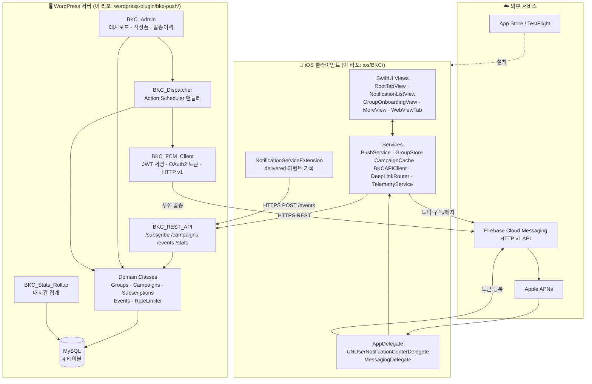
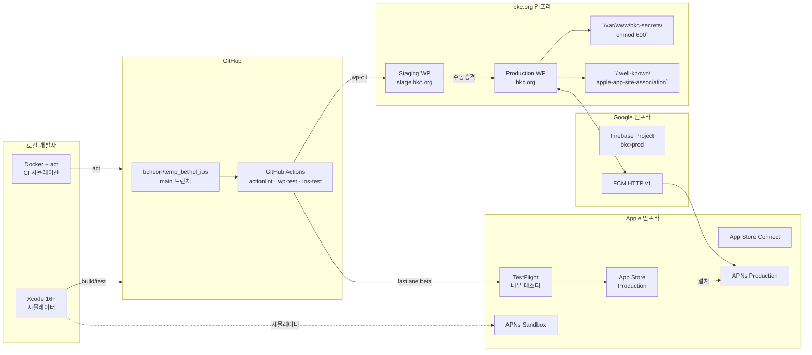
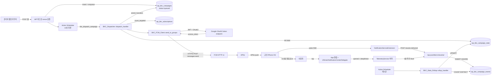
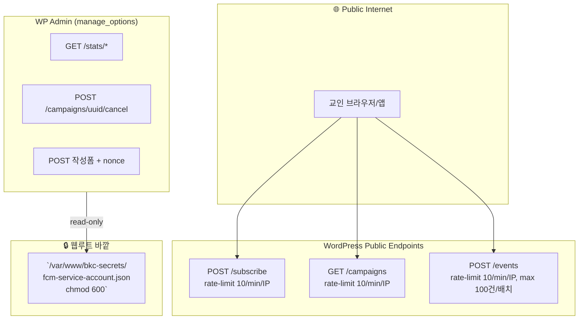
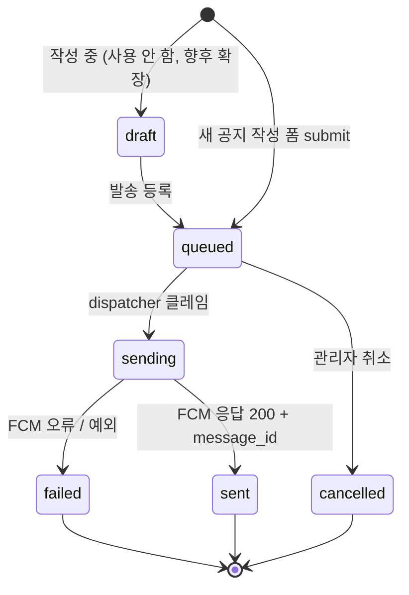
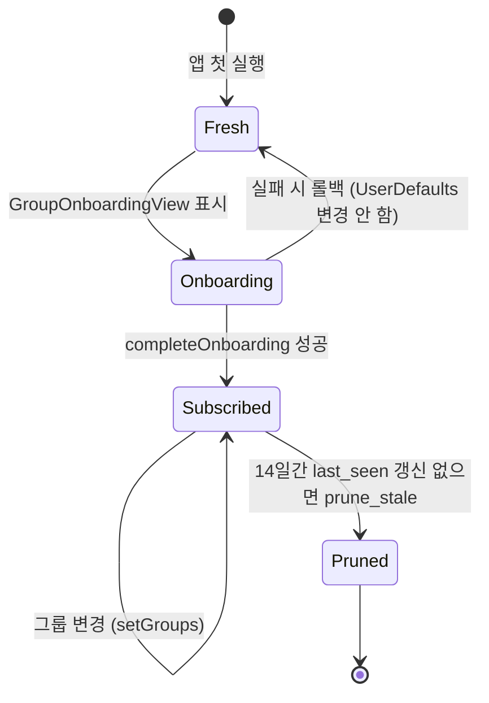

# 02. 아키텍쳐

## 컴포넌트 다이어그램

## 배포 토폴로지

## 데이터 흐름 — Push 발송 전체 경로

## 신뢰성 메커니즘

| 메커니즘 | 위치 | 보호 대상 |
|---------|------|----------|
| **Idempotency token** | `compose.php` form + `BKC_Campaigns::find_by_uuid` | 더블 submit 시 캠페인 1개만 생성 |
| **Atomic state transition** | `BKC_Campaigns::transition_status` (`WHERE status=$from`) | 동시 dispatcher가 같은 캠페인 두 번 발송 안 함 |
| **Action Scheduler 재시도** | WP 표준 메커니즘 | 일시적 장애 시 자동 재시도 |
| **OAuth2 토큰 캐싱** | `BKC_FCM_Client` (50분 transient) | 매번 JWT 서명 안 해서 부담 적음 |
| **Group sync rollback** | iOS `GroupSync.apply` | FCM 부분 실패 시 모든 변경 롤백 |
| **Rate limiting** | `BKC_Rate_Limiter` (per-IP transient) | 같은 IP의 폭주 차단 |
| **Telemetry offline buffer** | iOS `TelemetryService` (UserDefaults) | 네트워크 끊겨도 7일간 버퍼링 |
| **NSE 5초 타임 budget** | `NotificationService.didReceive` (DispatchGroup wait 5s) | 네트워크 느려도 알림 표시는 보장 |
| **Server-side dedup** | `INSERT IGNORE` + UNIQUE key on (device, campaign, event_type) | 같은 이벤트 중복 카운트 안 됨 |
| **Stats rollup 멱등** | `BKC_Stats_Rollup::rollup_single` (COUNT DISTINCT 재계산) | 두 번 돌려도 같은 숫자 |

## 보안 경계

핵심 룰:

- 공개 엔드포인트는 **rate-limit + 입력 sanitize 만**. 인증 안 함 (디바이스 UUID는 비밀이 아님).
- 관리자 엔드포인트는 **`current_user_can('manage_options')` 가드 필수**.
- 발송 키(`fcm-service-account.json`)는 **웹 루트 바깥** + chmod 600 + WP 프로세스만 읽기.
- iOS 앱에는 **자격 증명 없음**. 토큰만 가짐. 누가 토큰을 훔쳐도 푸쉬 발송은 못 함.

## 라이프사이클 상태

### 캠페인 상태 머신

### 디바이스 구독 라이프사이클

## 주요 파일 위치 요약

| 책임 | 파일 |
|------|------|
| iOS 진입점 | `ios/BKC/BKC/App/BKCApp.swift`, `AppDelegate.swift` |
| iOS 푸쉬 | `ios/BKC/BKC/Services/PushService.swift` |
| iOS 그룹 관리 | `ios/BKC/BKC/Services/GroupStore.swift` |
| iOS API 클라이언트 | `ios/BKC/BKC/Services/BKCAPIClient.swift` |
| iOS NSE | `ios/BKC/BKCNotificationServiceExtension/NotificationService.swift` |
| WP 진입점 | `wordpress-plugin/bkc-push/bkc-push.php` |
| WP REST | `wordpress-plugin/bkc-push/includes/class-bkc-rest-api.php` |
| WP 발송 | `wordpress-plugin/bkc-push/includes/class-bkc-dispatcher.php` |
| WP FCM 클라이언트 | `wordpress-plugin/bkc-push/includes/class-bkc-fcm-client.php` |
| WP 통계 집계 | `wordpress-plugin/bkc-push/includes/class-bkc-stats-rollup.php` |
| WP 어드민 UI | `wordpress-plugin/bkc-push/admin/class-bkc-admin.php` |
| AASA | `well-known/apple-app-site-association` |
| CI | `.github/workflows/ci.yml` |

## 다음에 읽기

- 위 다이어그램의 각 화살표를 시간순으로 펼친 것 → [`03-시퀀스-다이어그램.md`](03-시퀀스-다이어그램.md)
- 클래스끼리 누가 누구를 호출하는지 → [`04-클래스-관계도.md`](04-클래스-관계도.md)
