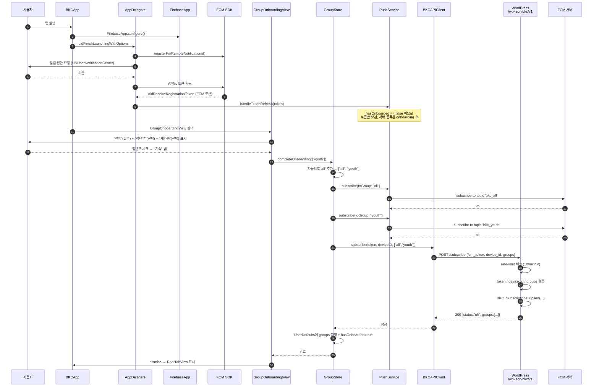
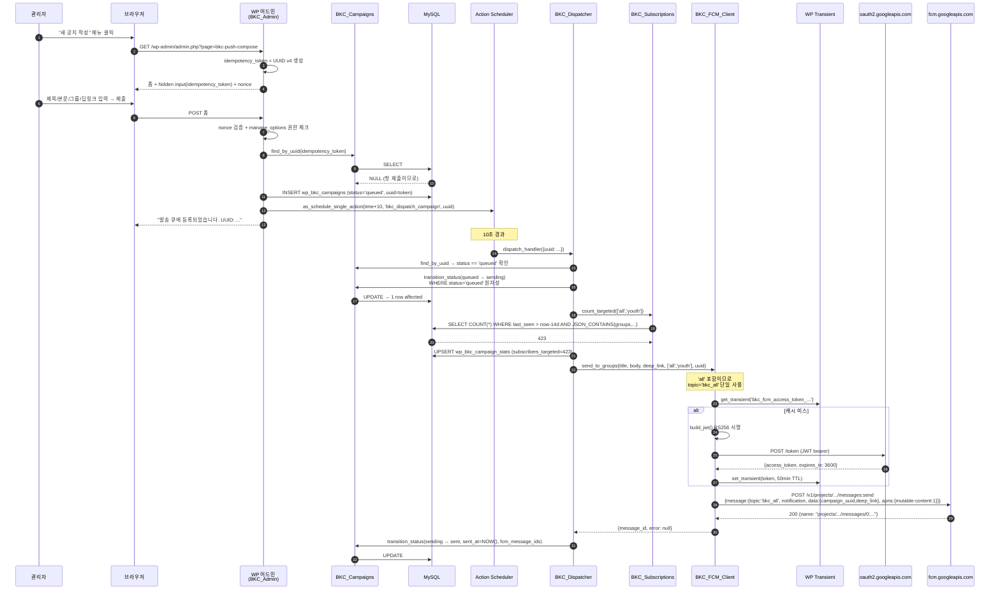
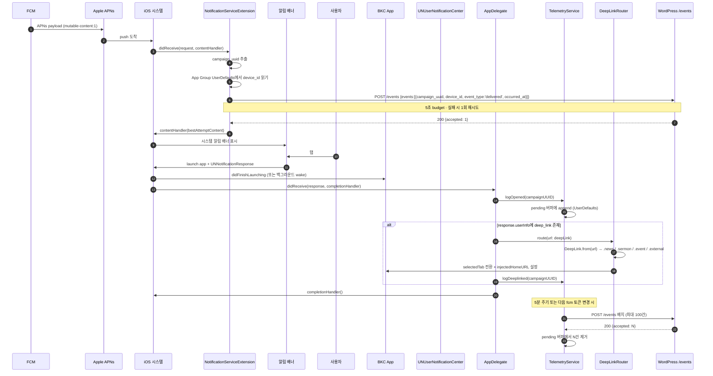
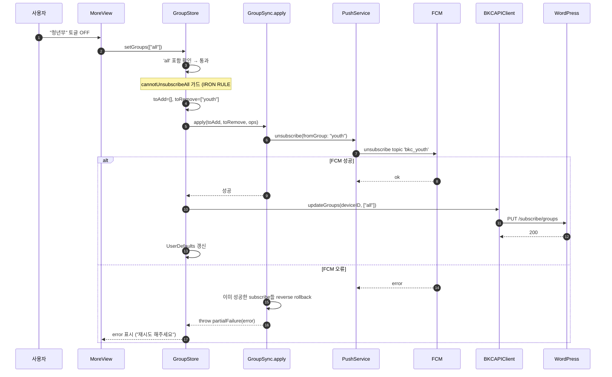
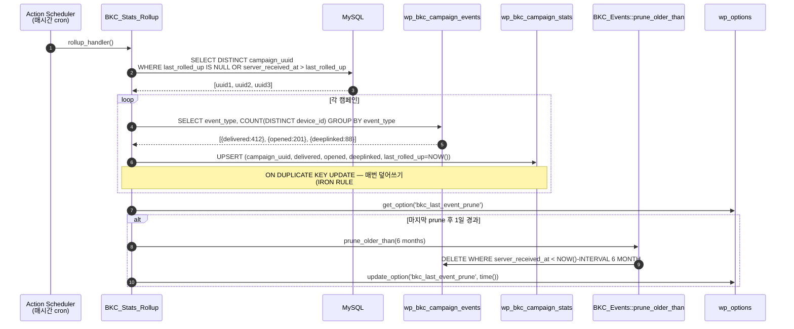
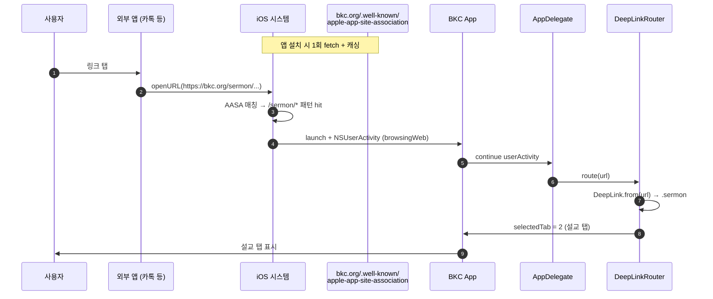

# 03. 시퀀스 다이어그램

이 문서는 BKC 푸쉬 시스템의 5가지 핵심 플로우를 단계별로 보여줍니다. 다이어그램이 안 보이면 [`README.md`의 다이어그램 안 보일 때](README.md#다이어그램-안-보일-때) 섹션 참고.

---

## 1. 앱 첫 실행 + 그룹 온보딩 + 구독 등록

신규 사용자가 앱을 처음 열었을 때.

**실패 시 롤백:** 위 5번~10번 중간에 실패하면 `GroupSync.apply`가 이미 성공한 subscribe를 unsubscribe로 되돌립니다 ([IRON RULE #5](../doc/testing.md)).

---

## 2. 관리자가 새 공지를 발송한다

WP 관리자 페이지에서 발송 버튼을 누른 순간부터 첫 디바이스에 도달하기까지.

**핵심 IRON RULE:** 같은 idempotency_token으로 두 번 제출해도 캠페인은 1개만 만들어집니다 (`Test_Idempotency.php`).

---

## 3. iPhone이 푸쉬를 받는다 (앱 백그라운드/종료 상태)

FCM이 발송한 후 사용자 디바이스에서 일어나는 일.

**대안 시나리오 — 앱이 포그라운드에 있을 때:** `willPresent`가 호출되어 `delivered` 이벤트가 즉시 기록되고 시스템 배너 옵션을 직접 결정합니다 (`AppDelegate.swift:60`).

---

## 4. 사용자가 그룹을 변경한다 (구독/해지 + 롤백)

설정 화면에서 청년부 구독을 해지하는 시나리오.

여러 그룹 동시 변경 시 (예: 청년부 OFF + 새가족 ON), 도중 실패 시 모든 부분 변경이 자동 롤백됩니다 ([IRON RULE #5](../doc/testing.md)).

---

## 5. 통계 집계 (Stats Rollup)

매시간 누적된 raw event들을 캠페인별 집계 카운터로 변환.

핵심: `rollup_single`은 **누적 INCREMENT가 아니라 COUNT DISTINCT 재계산**입니다. 그래서 어떤 시점에 잘못 돌아도 다음 실행 때 자동으로 정정됩니다.

---

## 6. Universal Link로 외부 사이트에서 앱 열기 (보너스)

사용자가 카톡/메일에서 `https://bkc.org/sermon/2024-12-25` 링크를 탭한 경우.

**전제:** `well-known/apple-app-site-association` 파일이 `https://bkc.org/.well-known/apple-app-site-association`로 정확하게 서비스 중이어야 함. Content-Type은 `application/json`. 리다이렉트 금지. CDN/WAF에서 Apple AASA bot을 화이트리스트해야 함.

## 다음에 읽기

- 위 시퀀스에 등장한 클래스들의 책임 분리 → [`04-클래스-관계도.md`](04-클래스-관계도.md)
- DB 테이블 컬럼 / JSON 페이로드 형식 → [`05-데이터-모델.md`](05-데이터-모델.md)
