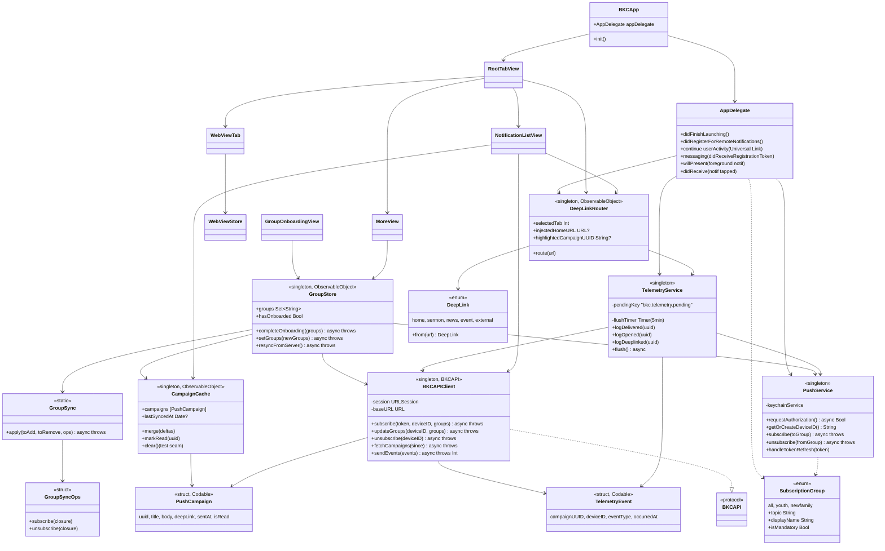
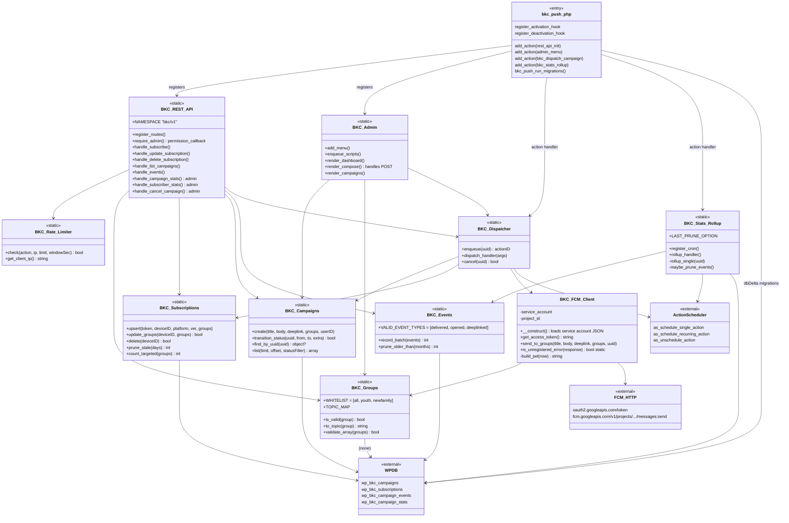

# 04. 클래스 관계도

## iOS Swift 클래스 — 책임 분리

iOS 앱은 **싱글톤 서비스 + ObservableObject + SwiftUI Views** 구조입니다.



### iOS 핵심 클래스 책임 한 줄 요약

| 클래스 | 한 줄 |
|--------|------|
| `BKCApp` | `@main` 진입점. Firebase 초기화, AppDelegate 부착. |
| `AppDelegate` | iOS 시스템 콜백 허브. APNs 토큰, FCM 토큰, 알림 탭, Universal Link. |
| `PushService` | FCM 토픽 구독/해지 + Keychain 디바이스 ID. **외부 SDK와의 유일한 접점.** |
| `GroupStore` | "사용자가 어떤 그룹을 구독 중"이라는 진실의 단일 출처. UI가 관찰. 변경 시 FCM + 서버 양쪽 동기화 + 롤백. |
| `GroupSync` | rollback 로직만 담당하는 순수 함수. 테스트가 mock ops 주입 가능. |
| `CampaignCache` | 받은 공지 메모리/디스크 캐시 (최대 50개, FIFO). |
| `BKCAPIClient` | WordPress REST API 호출 래퍼. 5xx 1회 재시도. |
| `DeepLinkRouter` | URL → 탭 전환 / WebView injection / external Safari 분기. |
| `TelemetryService` | delivered/opened/deeplinked 이벤트 버퍼링 + 5분 주기 flush. |
| `SubscriptionGroup` | 그룹 enum + FCM 토픽 매핑 (`youth → bkc_youth`). |
| `DeepLink` | URL 분류 enum. **WebView 안에서 안 열려야 할 외부 URL 판정.** |

### iOS 의존성 주입 / 테스트 가능성 패턴

세 가지 패턴이 반복됩니다:

1. **`URLSession` 주입** (`BKCAPIClient(session:)`) — 테스트가 `MockURLProtocol` 주입.
2. **Ops struct 추출** (`GroupSyncOps`) — `GroupSync.apply`가 `PushService` 직접 의존 안 함, closure 받음.
3. **`clear()` 테스트 seam** (`CampaignCache.clear`, `TelemetryService.loadPendingForTesting`) — 싱글톤 잔여 상태 리셋용 (production 호출 금지).

---

## PHP (WordPress 플러그인) 클래스 관계도

PHP 측은 **static 헬퍼 클래스 + WP 훅** 구조입니다 (PSR-4 namespace 안 씀, `BKC_` prefix).



### PHP 핵심 클래스 책임 한 줄 요약

| 클래스 | 한 줄 |
|--------|------|
| `bkc-push.php` | 플러그인 진입점. 클래스 로딩, 훅 등록, DB 마이그레이션. |
| `BKC_REST_API` | 8개 REST 엔드포인트 등록 + 핸들러. 입력 sanitize + 권한 체크. |
| `BKC_Admin` | WP 어드민 메뉴 + compose form POST 처리 + idempotency. |
| `BKC_Groups` | 그룹 화이트리스트 + FCM 토픽 매핑. **단일 출처.** |
| `BKC_Subscriptions` | `wp_bkc_subscriptions` CRUD + 활성 구독자 count + 14일 prune. |
| `BKC_Campaigns` | `wp_bkc_campaigns` CRUD + **원자적 status 전환** (`WHERE status=$from`). |
| `BKC_Events` | raw 이벤트 batch insert. UUID/timestamp 검증. INSERT IGNORE 로 dedup. |
| `BKC_Rate_Limiter` | per-IP per-action transient 카운터. |
| `BKC_Dispatcher` | Action Scheduler hook. queued→sending→sent/failed 전환 오케스트레이션. |
| `BKC_FCM_Client` | JWT 서명 + OAuth2 + FCM HTTP v1 호출. **외부 HTTP의 유일한 접점.** |
| `BKC_Stats_Rollup` | 매시간 cron. raw event → 캠페인별 집계. **멱등(IRON RULE #7).** |

### PHP 측 의존성 방향

화살표가 한 방향만 흐릅니다 (순환 의존성 없음):

```
Entry (bkc-push.php)
  ↓
Routing (REST_API, Admin)
  ↓
Domain (Campaigns, Subscriptions, Events, Groups, Rate_Limiter)
  ↓
Infrastructure (Dispatcher, FCM_Client, Stats_Rollup)
  ↓
External (WPDB, ActionScheduler, FCM HTTP)
```

---

## 양쪽을 잇는 계약 (Contract)

iOS와 PHP가 모두 알아야 하는 두 가지 계약:

### 1. 그룹 식별자 (양쪽이 똑같아야 함)

| Swift `SubscriptionGroup` | PHP `BKC_Groups::WHITELIST` | FCM 토픽 |
|---------------------------|----------------------------|---------|
| `.all` ("all") | `'all'` | `bkc_all` |
| `.youth` ("youth") | `'youth'` | `bkc_youth` |
| `.newfamily` ("newfamily") | `'newfamily'` | `bkc_newfam` |

> 새 그룹 추가 시 **양쪽 동시 업데이트 필수** (CLAUDE.md "보안 룰 #5"). 한쪽만 바꾸면 구독 등록은 되는데 발송이 안 되는 / 그 반대 상황 발생.

### 2. JSON 페이로드 (스네이크/카멜 변환)

iOS는 `JSONDecoder.keyDecodingStrategy = .convertFromSnakeCase` 사용. 즉:
- 서버: `campaign_uuid`, `device_id`, `target_groups`, `sent_at`
- Swift: `campaignUUID`, `deviceID`, `targetGroups`, `sentAt`

이벤트 타입은 변환되지 않으므로 양쪽 모두 lower snake case:
- `delivered`, `opened`, `deeplinked`

## 다음에 읽기

- 위 클래스가 다루는 DB 컬럼 / JSON 형식 → [`05-데이터-모델.md`](05-데이터-모델.md)
- 새 개발자가 처음 코드를 만지기 전에 → [`06-개발환경-셋업.md`](06-개발환경-셋업.md)
