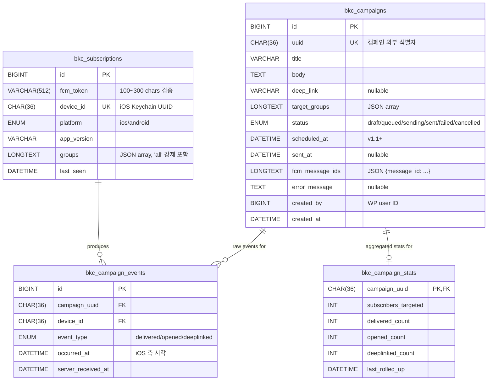
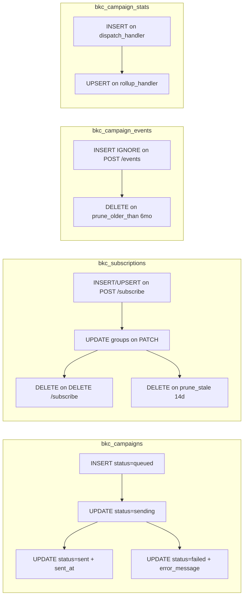

# 05. 데이터 모델

## ER 다이어그램 — MySQL 4 테이블



## 인덱스 / 제약 조건

| 테이블 | 인덱스 | 이유 |
|--------|-------|-----|
| `bkc_campaigns` | `UNIQUE uuid` | idempotency token으로 사용 (같은 UUID로 두 번 INSERT 시 실패) |
| `bkc_campaigns` | `KEY idx_status` | dispatcher가 queued 빠르게 찾기 |
| `bkc_campaigns` | `KEY idx_created` | 어드민 발송 이력 정렬 |
| `bkc_subscriptions` | `UNIQUE device_id` | upsert ON DUPLICATE KEY 의 키 |
| `bkc_subscriptions` | `KEY idx_last_seen` | 14일 prune + active count |
| `bkc_campaign_events` | `KEY idx_campaign` | rollup 단위 |
| `bkc_campaign_events` | `KEY idx_device_time` | 사용자별 디버깅 |
| `bkc_campaign_events` | `UNIQUE (device_id, campaign_uuid, event_type)` | **dedup IRON RULE — 같은 이벤트 중복 카운트 방지** |

## 테이블별 라이프사이클



---

## REST API 페이로드

### `POST /wp-json/bkc/v1/subscribe` (공개, rate-limit 10/min/IP)

**Request:**
```json
{
  "fcm_token": "fyMHC...300자",
  "device_id": "550e8400-e29b-41d4-a716-446655440000",
  "platform": "ios",
  "app_version": "1.0.0",
  "groups": ["all", "youth"]
}
```

**Response 200:**
```json
{ "status": "ok", "groups": ["all", "youth"] }
```

**Response 4xx:**
- `400 invalid_token` — FCM 토큰 길이 100~300자 안 맞거나 정규식 실패
- `400 invalid_device_id` — UUID v4 형식 X
- `400 invalid_groups` — 화이트리스트 외 그룹
- `429 rate_limited` — IP 한도 초과

### `PATCH /wp-json/bkc/v1/subscribe/{device_id}`

**Request:**
```json
{ "groups": ["all", "newfamily"] }
```

서버는 `'all'` 미포함 시 자동 추가. 디바이스 not found면 `404`.

### `DELETE /wp-json/bkc/v1/subscribe/{device_id}`

Body 없음. 디바이스 not found면 `404`.

### `GET /wp-json/bkc/v1/campaigns?since=2024-12-01T00:00:00Z&limit=20`

**Response 200:**
```json
[
  {
    "uuid": "550e...",
    "title": "주일예배 안내",
    "body": "오전 10시...",
    "deep_link": "https://bkc.org/sermon/2024-12-25",
    "sent_at": "2024-12-25T01:00:00Z"
  }
]
```

`limit` 1~50, `since` 옵션. status='sent'만 반환.

### `POST /wp-json/bkc/v1/events` (NSE + 앱 둘 다 사용)

**Request (최대 100건/배치):**
```json
{
  "events": [
    {
      "campaign_uuid": "550e...",
      "device_id": "770e...",
      "event_type": "delivered",
      "occurred_at": "2024-12-25T01:00:05.123Z"
    },
    {
      "campaign_uuid": "550e...",
      "device_id": "770e...",
      "event_type": "opened",
      "occurred_at": "2024-12-25T01:02:30.000Z"
    }
  ]
}
```

**Response:**
```json
{ "accepted": 2 }
```

`accepted`는 **새로 INSERT된 (= dedup 통과) 건수**. 이미 같은 (device_id, campaign_uuid, event_type) 조합이 있으면 INSERT IGNORE로 조용히 스킵.

### `GET /wp-json/bkc/v1/stats/campaign/{uuid}` (관리자 전용)

**Response 200:**
```json
{
  "campaign_uuid": "550e...",
  "subscribers_targeted": 423,
  "delivered_count": 412,
  "opened_count": 201,
  "deeplinked_count": 88,
  "delivery_rate": 0.974,
  "open_rate": 0.488,
  "deeplink_ctr": 0.438,
  "last_rolled_up": "2024-12-25T02:00:00Z"
}
```

---

## FCM 메시지 페이로드 (서버 → FCM)

`BKC_FCM_Client::send_to_groups`가 만드는 페이로드:

```jsonc
{
  "message": {
    // target — 다음 셋 중 하나만:
    "topic": "bkc_all",                                         // 'all' 포함 또는 단일 그룹
    // OR
    "condition": "'bkc_youth' in topics || 'bkc_newfam' in topics", // 2~5개 그룹

    "notification": { "title": "...", "body": "..." },

    "data": {
      "campaign_uuid": "550e...",
      "deep_link": "https://bkc.org/sermon/..."   // optional
    },

    "apns": {
      "headers": { "apns-priority": "10" },
      "payload": {
        "aps": {
          "mutable-content": 1,                    // NSE 가 wake 되도록
          "alert": { "title": "...", "body": "..." }
        }
      }
    }
  }
}
```

### 그룹 → FCM target 변환 규칙 (IRON RULE #2)

| 입력 그룹 | 결과 |
|----------|------|
| `["all"]` | `topic: "bkc_all"` |
| `["all", "youth"]` | `topic: "bkc_all"` (all이 우선) |
| `["youth"]` | `topic: "bkc_youth"` |
| `["youth", "newfamily"]` | `condition: "'bkc_youth' in topics \|\| 'bkc_newfam' in topics"` |
| 6개 이상 | `InvalidArgumentException` (FCM 한도) |

---

## iOS 측 영속 데이터

| 위치 | 키 / 파일 | 무엇 |
|------|----------|------|
| Keychain | service=`org.bkc.churchapp`, account=`deviceID` | 디바이스 UUID (앱 재설치 시에도 보존됨 ← Keychain 정책 따라) |
| UserDefaults | `bkc.deviceID` | 디바이스 UUID (Keychain 백업) |
| UserDefaults | `bkc.groups` | 구독 중인 그룹 배열 |
| UserDefaults | `bkc.hasOnboarded` | 온보딩 완료 여부 |
| UserDefaults | `bkc.telemetry.pending` | 미발송 텔레메트리 이벤트 (JSON) |
| Caches dir | `campaigns.json` | 받은 공지 목록 (최대 50개) |
| App Group UserDefaults | suite `group.org.bkc.churchapp`, key `device_id` | NSE 가 읽을 수 있도록 device_id 공유 (v1.1) |
| Info.plist | `BKC_API_BASE_URL` | API base URL (기본 `https://bkc.org/wp-json/bkc/v1`) |

---

## 앱 → 서버 매핑 — 같은 데이터 다른 이름

iOS의 `JSONDecoder.keyDecodingStrategy = .convertFromSnakeCase`로 자동 변환됩니다:

| 의미 | 서버 (snake) | iOS (camel) | 비고 |
|------|--------------|-------------|------|
| 캠페인 ID | `campaign_uuid` | `campaignUUID` | UUID v4 |
| 디바이스 ID | `device_id` | `deviceID` | UUID v4 |
| 발송 시각 | `sent_at` | `sentAt` | ISO 8601 UTC |
| 딥링크 | `deep_link` | `deepLink` | URL? |
| 대상 그룹 | `target_groups` | `targetGroups` | `[String]` |
| 이벤트 타입 | `event_type` | `eventType` | `String` (변환 X) |
| 발생 시각 | `occurred_at` | `occurredAt` | ISO 8601 UTC |
| 발송 시각 | `last_seen` | (서버 전용) | 14일 활성도 측정용 |

**예외 — 변환되지 않는 것:**
- `event_type` 의 값 (`delivered`/`opened`/`deeplinked`)은 enum에 가까워서 그대로 사용

## 다음에 읽기

- 위 데이터를 만드는 클래스들의 역할 → [`04-클래스-관계도.md`](04-클래스-관계도.md)
- 직접 데이터 만져보기 → [`06-개발환경-셋업.md`](06-개발환경-셋업.md)
