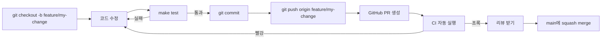
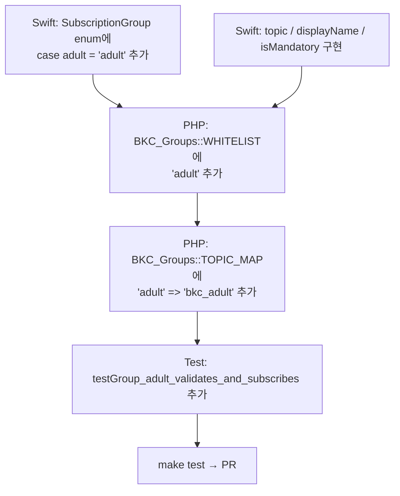

# 06. 개발환경 셋업

신규 IT팀 멤버가 처음 코드를 받아 첫 PR까지 가는 과정.

## 0. 사전 요건

| 항목 | 필요 여부 |
|------|----------|
| **Mac (Apple Silicon 또는 Intel)** | iOS 빌드 시 필수. WP만 만질 거면 Linux/Windows OK |
| **macOS 13.5+** | Xcode 16 요구사항 |
| **GitHub 계정 + 리포 read 권한** | 필수 |
| **Apple Developer 계정** | 시뮬레이터만 돌릴 거면 불필요. 실기기 빌드 시 필요 |
| **bkc.org WP 관리자 계정** | 통합 테스트 시 필요. 로컬 PHPUnit만 돌릴 거면 불필요 |
| **Firebase 콘솔 viewer 권한** | FCM 트러블슈팅 시 필요 |

## 1. 리포 클론

```bash
git clone <repo URL>
cd uneven-gazelle
```

## 2. 도구 한 번에 설치

```bash
make install
```

이 명령이 하는 일:
- `brew install php@8.5 composer xcodegen act`
- `php@8.5`를 PATH에 추가 (필요시)
- `composer install` (wordpress-plugin/bkc-push)

> **Xcode는 brew로 안 깔립니다.** App Store에서 직접 설치 (16+ 권장 — Firebase 12.x SPM resolve용).

## 3. 첫 테스트 실행 — 환경 검증

```bash
make test-wp     # < 1초, 어디서나 동작
```

기대 결과: `OK (41 tests, ~150 assertions)`. 실패 시 → [`08-FAQ-트러블슈팅.md`](08-FAQ-트러블슈팅.md) 참고.

Mac이면:
```bash
make test-ios    # ~30초, 시뮬레이터 빌드 + XCTest + XCUITest
```

## 4. iOS 프로젝트 열기

```bash
make xcodeproj
open ios/BKC/BKC.xcodeproj
```

> `BKC.xcodeproj`는 `.gitignore` 됨. 진실의 출처는 `ios/BKC/project.yml`. xcodeproj 안에서 새 파일 추가하면 다음에 `make xcodeproj` 돌리면 사라집니다 — **반드시 `project.yml`도 같이 업데이트**하거나, `BKCTests/` / `BKC/` 폴더에 그냥 파일 추가하면 됩니다 (XcodeGen이 자동 감지).

### 필요한 두 개의 placeholder 파일

리포에 들어 있는 placeholder는 **CI / 시뮬레이터 빌드만 통과**용이지 진짜 프로덕션 키 아닙니다:

1. `ios/BKC/BKC/Resources/GoogleService-Info.plist.template` — Firebase 콘솔에서 다운로드한 실제 plist를 같은 위치에 `GoogleService-Info.plist`로 저장 (gitignore됨)
2. `well-known/apple-app-site-association` 의 `YOUR_TEAM_ID` — Apple Team ID로 치환 (배포 시)

## 5. 첫 변경 → 첫 PR 흐름



### 권장 워크플로

```bash
# 1) 새 브랜치
git checkout main && git pull
git checkout -b feature/my-change

# 2) 변경
# ... 코딩 ...

# 3) 로컬 검증 (커밋 전)
make test-wp                        # PHP 만지면
make test-ios                       # Swift 만지면 (Mac만)
make ci-local                       # CI 흐름 그대로 시뮬레이션

# 4) 커밋
git add <files>
git commit -m "feat(ios): add X"

# 5) PR
git push -u origin feature/my-change
gh pr create --fill
```

## 6. 디렉터리 약도

```
.
├── ios/BKC/                       # iOS 앱 + NSE
│   ├── BKC/
│   │   ├── App/                   # @main + AppDelegate
│   │   ├── Views/                 # SwiftUI 화면
│   │   ├── Services/              # 싱글톤 비즈니스 로직
│   │   ├── Models/                # struct/enum 데이터
│   │   └── Resources/             # plist, entitlements
│   ├── BKCNotificationServiceExtension/
│   ├── BKCTests/                  # XCTest (34개)
│   ├── BKCUITests/                # XCUITest (3개)
│   └── project.yml                # XcodeGen — 진실의 출처
│
├── wordpress-plugin/bkc-push/    # WordPress 플러그인
│   ├── bkc-push.php               # 진입점 + DB 마이그레이션
│   ├── includes/                  # 9개 도메인 클래스
│   ├── admin/                     # 어드민 메뉴 + view PHP
│   ├── tests/                     # PHPUnit (41개)
│   └── composer.json
│
├── well-known/                    # AASA (Universal Links)
├── doc/                           # 상세 사양 (개발자용)
├── onboarding/                    # 이 폴더 — 온보딩용
├── .github/workflows/ci.yml       # GitHub Actions
├── fastlane/                      # iOS 자동 배포
├── Makefile                       # 진입점 명령
└── CLAUDE.md                      # AI 협업 컨벤션
```

## 7. 흔한 첫 작업 시나리오

### 시나리오 A: WP 플러그인 PHP 함수 하나 고치기

1. `wordpress-plugin/bkc-push/includes/class-bkc-*.php` 수정
2. 테스트 추가: `tests/Test_<Name>.php` (PascalCase basename + `extends TestCase`)
3. `make test-wp`
4. PR

### 시나리오 B: iOS Service 메서드 하나 추가

1. `ios/BKC/BKC/Services/<Service>.swift` 수정
2. 테스트 추가: `ios/BKC/BKCTests/<Service>Tests.swift` (자동 포함됨)
3. 새 파일 추가 시 `make xcodeproj` 한 번 (XcodeGen 재실행)
4. `make test-ios`
5. PR

### 시나리오 C: 새 그룹 추가 (예: "장년부")

> 양쪽을 동시 업데이트해야 함! (보안 룰 #5)



이 항목 빠뜨리면 — 사용자가 구독 등록은 되는데 실제 발송이 안 됨 (또는 그 반대).

### 시나리오 D: 새 IRON RULE 추가

회귀 방지 IRON RULE은 **3곳 동시 업데이트**:
1. 위 표에 1줄 추가 (`CLAUDE.md` "테스트 IRON RULE")
2. `doc/ios-app-plan.md` "회귀 방지" 섹션
3. `doc/testing.md`

## 8. 자주 쓰는 디버깅 명령

```bash
# WP 플러그인
cd wordpress-plugin/bkc-push
vendor/bin/phpunit --filter Test_FCM_Client::test_condition_dedup_iron_rule    # 단일 테스트
vendor/bin/phpunit --testdox                                                   # 사람이 읽기 좋은 출력

# iOS
xcodebuild test -project ios/BKC/BKC.xcodeproj -scheme BKC \
  -destination 'platform=iOS Simulator,name=iPhone 16,OS=latest' \
  -only-testing:BKCTests/GroupStoreTests   # 단일 클래스만

# CI 로컬 시뮬레이션
make ci-local                                # GitHub Actions wp-test 잡 그대로

# Action Scheduler 큐 보기 (WP 통합 환경)
wp action-scheduler list --status=pending --hooks=bkc_dispatch_campaign

# FCM 토픽 확인
# Firebase Console → Project → Cloud Messaging → Topics
```

## 9. 코딩 컨벤션 빠른 참고

자세한 룰은 [`../CLAUDE.md`](../CLAUDE.md) "코딩 컨벤션" 참조. 핵심만:

### Swift
- iOS 16+ minimum, Swift 5.9
- 강제 unwrap (`!`) 금지 — `guard let ... else { fatalError(...) }` 사용
- 한국어 UI 라벨은 그대로 코드에 (Localizable.strings는 v1.1)
- 싱글톤은 명시적 `static let shared`
- 에러는 typed enum

### PHP
- WP 코딩 스타일: snake_case, `BKC_` prefix
- 모든 `$wpdb` 호출은 `prepare()` + 플레이스홀더
- Admin view 출력은 `esc_html` / `esc_attr` / `esc_url` / `wp_kses_post`
- 새 Admin REST 라우트 추가 시 `permission_callback` 잊지 말 것

## 10. 도움 요청 채널

| 무엇 | 어디 |
|------|------|
| 빠른 질문 | (교회 IT팀 전용 채널 — 신규 멤버는 가입 요청) |
| 버그 / 기능 요청 | GitHub Issues |
| 보안 취약점 | (개인 메일로 비공개 보고) |
| App Store / Apple 정책 | Apple Developer 계정 보유자 |
| Firebase / FCM | Firebase Console 또는 GCP 지원 |

## 다음에 읽기

- 빌드한 걸 실제로 배포하기 → [`07-배포-가이드.md`](07-배포-가이드.md)
- 셋업 도중 막혔을 때 → [`08-FAQ-트러블슈팅.md`](08-FAQ-트러블슈팅.md)
