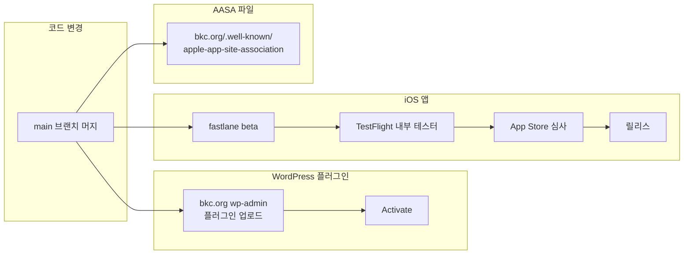
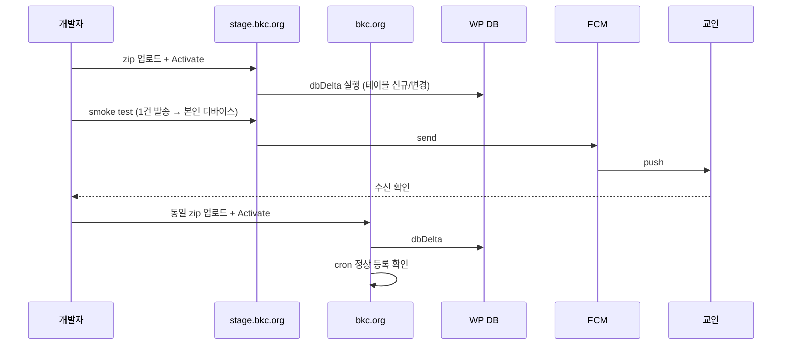
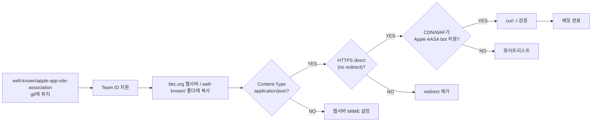
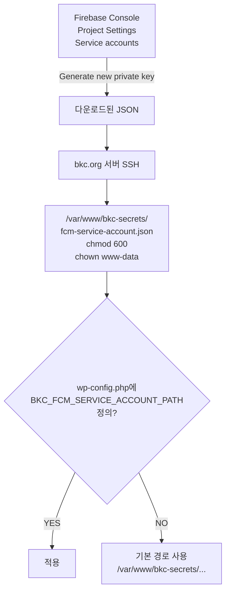
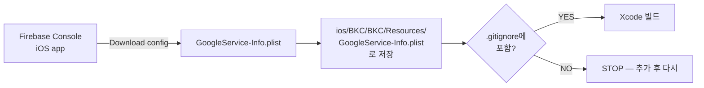

# 07. 배포 가이드

## 배포 대상 3가지



세 트랙은 **독립 배포**합니다. WP 플러그인은 매주 fix 릴리스 가능, iOS는 App Store 심사 때문에 보통 격주~월간.

## A. WordPress 플러그인 배포

### A.1 배포 전 체크리스트

- [ ] `make test-wp` 통과
- [ ] `composer.lock` 변경 시 PR에 포함
- [ ] DB 마이그레이션 변경 시 `bkc_push_run_migrations()` 검토 (dbDelta는 ALTER TABLE 안전하지만 ENUM 추가 등은 별도)
- [ ] 새 REST 라우트 추가 시 `permission_callback` 가드 확인
- [ ] PHP error log clean 확인 (staging에서)

### A.2 Staging 배포

```bash
# 로컬에서 zip 만들기
cd wordpress-plugin
zip -r bkc-push-1.0.1.zip bkc-push -x 'bkc-push/tests/*' 'bkc-push/vendor/*'

# stage.bkc.org wp-admin → 플러그인 → 새로 추가 → 업로드
# Activate 후 Action Scheduler 정상 동작 확인:
#   wp action-scheduler list --status=pending --hooks=bkc_stats_rollup
```

### A.3 Production 배포



### A.4 롤백

WP는 같은 슬러그로 이전 버전 zip을 다시 업로드하면 됩니다. **단, DB 스키마가 변경된 경우 dbDelta가 컬럼을 자동 제거하지 않습니다 — 수동 ALTER 필요.**

---

## B. iOS 앱 배포

### B.1 배포 전 체크리스트

- [ ] `make test-ios` 통과 (Mac)
- [ ] `ios/BKC/project.yml` 의 `MARKETING_VERSION` 증가
- [ ] `CURRENT_PROJECT_VERSION` (build number) 증가 — 같은 번호 두 번 업로드 거부됨
- [ ] `GoogleService-Info.plist`가 production Firebase 프로젝트 키인지 확인 (placeholder 아님)
- [ ] `well-known/apple-app-site-association` 의 Team ID가 올바른지 확인
- [ ] CHANGELOG / 릴리스 노트 작성

### B.2 TestFlight 업로드

```bash
# 사전: fastlane match 셋업 완료 (인증서/프로비저닝 동기화)
bundle exec fastlane beta
```

`fastlane/Fastfile`이 하는 일:
1. XcodeGen으로 `.xcodeproj` 재생성
2. `gym`으로 archive
3. `pilot`으로 App Store Connect 업로드
4. TestFlight 내부 테스터 그룹에 자동 배포

### B.3 App Store 제출

1. App Store Connect 웹에서 새 버전 생성
2. TestFlight 빌드 선택
3. 스크린샷 / 설명 / 키워드 / 카테고리 입력
4. **개인정보처리방침 URL 필수** (수집 항목 · 보관 기간 · 텔레메트리 설명)
5. 심사 제출 → 보통 24~48시간

### B.4 단계적 배포 (Phased Release)

App Store Connect에서 "Phased release" 선택 시 7일에 걸쳐 1% → 100% 자동 확산. **첫 메이저 릴리스는 phased release 필수**.

### B.5 긴급 롤백 (Expedited Review)

심각 버그 발견 시 App Store Connect → "Expedite Review" 요청 + 새 빌드 업로드. 보통 4~12시간 안에 심사.

---

## C. AASA 파일 배포



### 검증 명령

```bash
# 1) Content-Type 및 redirect 확인
curl -I https://bkc.org/.well-known/apple-app-site-association
# 기대: HTTP/2 200 + Content-Type: application/json (또는 application/octet-stream OK)

# 2) JSON 유효성
curl -s https://bkc.org/.well-known/apple-app-site-association | jq .

# 3) Apple validator
# https://branch.io/resources/aasa-validator/ 또는
# https://search.developer.apple.com/appsearch-validation-tool/
```

### AASA 변경 시 캐시 주의

iOS가 AASA를 한 번 fetch 하면 재설치 전까지 안 다시 가져옵니다. 이미 설치된 사용자에게 새 AASA 적용하려면:
- 사용자가 앱 재설치, 또는
- 사용자가 iOS 설정 → 일반 → VPN/디바이스 관리 (X) — 사실상 재설치만 신뢰 가능

따라서 **AASA 패턴은 신중하게 정하고 한 번에 모든 패턴 포함**.

---

## D. 비밀 키 (Secrets) 관리

### D.1 FCM 서비스 계정 JSON (서버 측)



**절대 git에 커밋 금지.** 검증:

```bash
# git에서 추적되는지 확인 (none이어야 함)
git log --all --source --remotes --oneline -- '*service-account*' '*svc-acct*'

# 서버 권한 확인
sudo -u www-data cat /var/www/bkc-secrets/fcm-service-account.json | head -1
# 다른 유저로는 읽기 실패해야 정상
```

### D.2 GoogleService-Info.plist (iOS 측)



리포의 `GoogleService-Info.plist.template`은 placeholder. CI/시뮬레이터 빌드용. **프로덕션 빌드 시 실제 plist로 덮어써야 함**.

### D.3 Apple 인증서 / 프로비저닝 프로파일

`fastlane match`로 별도 private git 리포에 암호화 저장. 새 개발자 합류 시:

```bash
bundle exec fastlane match development --readonly
bundle exec fastlane match appstore --readonly
```

`MATCH_PASSWORD` 환경변수 필요. 1Password 또는 팀 비밀번호 매니저로 공유.

---

## E. 배포 후 모니터링

### 첫 1시간 체크 항목

| 항목 | 어디서 보나 |
|------|----------|
| FCM 발송 성공률 | Firebase Console → Cloud Messaging → 발송 이력 |
| 텔레메트리 수신률 | WP 어드민 → 푸쉬 공지 → 캠페인 통계 (`delivered_count` / `subscribers_targeted`) |
| WP PHP error log | `tail -f /var/log/php_errors.log` 또는 호스팅 패널 |
| Action Scheduler 큐 적체 | `wp action-scheduler list --status=failed` |
| iOS 앱 크래시 | App Store Connect → Xcode Organizer → Crashes |
| 사용자 피드백 | App Store 리뷰 (대부분 별점 + 짧은 코멘트) |

### Health 알람 (사람의 눈)

자동 알람 시스템이 v1.0에는 없습니다 (v1.2 로드맵). 그래서 **배포 후 1~2시간은 사람이 직접 봐야 함**.

자동 알람 도입 전까지 권장 루틴:
- 배포 후 30분: smoke test (관리자 본인 디바이스로 테스트 발송)
- 배포 후 2시간: 캠페인 통계 페이지에서 평균 delivery rate 확인 (목표: > 90%)
- 배포 후 24시간: 사용자 보고/리뷰 모니터링

---

## F. 배포 캘린더 / 동결 윈도우

| 시점 | 배포 가능? |
|------|----------|
| 평일 10:00~16:00 KST | ✅ 표준 |
| 주일 09:00~14:00 KST | ❌ 예배 시간 — 발송 트래픽 피크 |
| 주요 절기 (성탄절, 부활절 등) 직전 1주 | ⚠️ critical fix만 |
| App Store 연휴 freeze (Dec 23 ~ Dec 29) | ❌ Apple이 심사 안 함 |

## 다음에 읽기

- 배포 / 사용 중 발생하는 흔한 문제 → [`08-FAQ-트러블슈팅.md`](08-FAQ-트러블슈팅.md)
- 약어 헷갈릴 때 → [`09-용어집.md`](09-용어집.md)
