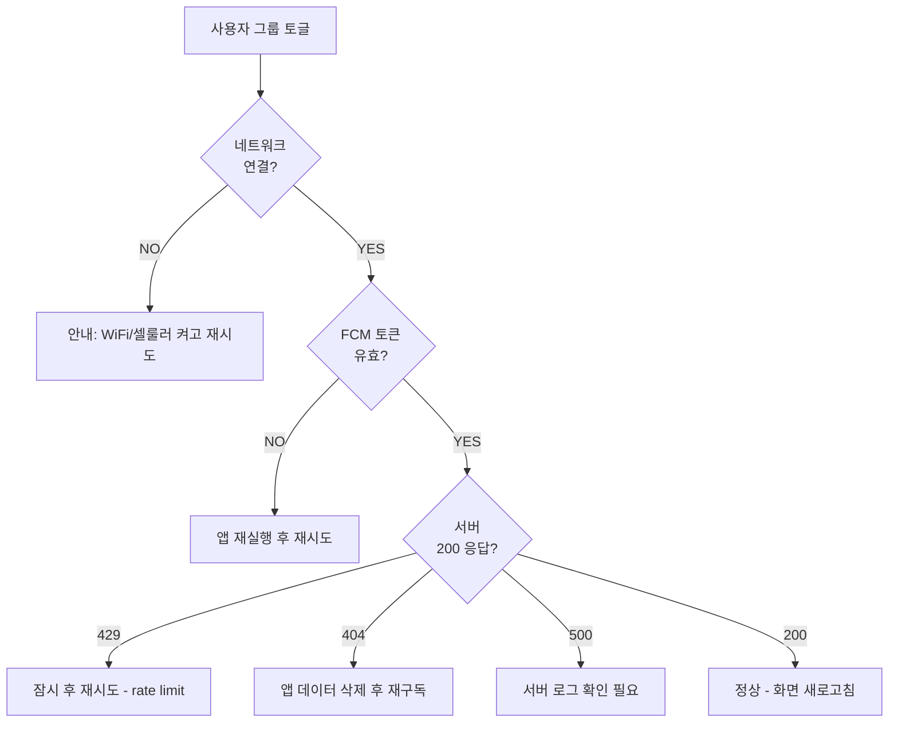
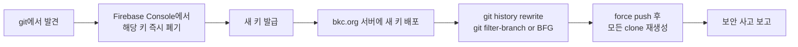

# 08. FAQ + 트러블슈팅

## 운영 / 사용 FAQ

### Q1. 발송했는데 일부 사용자가 못 받았어요

**가능 원인 (확률 순):**

1. **앱이 백그라운드/종료 상태에서 OS가 알림 권한 회수** — 사용자가 설정에서 직접 끔
2. **iOS 저전력 모드 + Focus 모드** — Apple이 발송을 지연/생략
3. **FCM 토큰 만료** — 앱을 90일 이상 안 열면 토큰 invalid → `is_unregistered_error` 가 캐치하지만 v1.0에서는 자동 정리 안 함
4. **사용자가 그룹 미구독** — 새가족 발송인데 새가족 그룹 구독 안 한 경우
5. **로컬 14일 prune** — `last_seen` 14일 초과로 활성 구독자 카운트에서 제외

**확인 방법:**
- WP 어드민 → 푸쉬 공지 → 캠페인 통계: `subscribers_targeted` vs `delivered_count` 비교
- delivery rate > 95% 면 정상. < 90% 면 위 4번/5번 의심.

### Q2. 발송 버튼을 눌렀는데 통계가 0으로 나와요

**원인:**
- Action Scheduler cron이 안 돌고 있음. WP cron은 트래픽 없으면 트리거 안 됨.

**확인:**
```bash
wp action-scheduler list --status=pending --hooks=bkc_dispatch_campaign
```

**해결:**
```bash
# 즉시 강제 실행
wp action-scheduler run --hooks=bkc_dispatch_campaign

# 영구 해결: 시스템 cron으로 wp-cron 매분 트리거
# crontab -e
# * * * * * cd /var/www/bkc.org && wp cron event run --due-now > /dev/null 2>&1
```

또는 [WordPress Cron 설정](https://developer.wordpress.org/plugins/cron/hooking-wp-cron-into-the-system-task-scheduler/) 참고.

### Q3. 같은 알림이 두 번 와요

**가능 원인:**
1. 같은 캠페인을 두 디바이스로 받음 — 정상 (한 사람이 iPad + iPhone 둘 다 사용 중)
2. 사용자가 두 그룹 구독 (예: `all` + `youth`) — 발송이 condition일 때 FCM이 두 번 deliver: **불가능, IRON RULE #2가 막음**. condition 만들 때 OR 합쳐짐.
3. 진짜 dispatcher 두 번 호출 — `transition_status(queued→sending)` 가 막음. 이게 깨졌으면 IRON RULE 회귀.

`Test_Idempotency.php` 가 통과하는 한 #3 은 발생 안 함.

### Q4. 통계 숫자가 이상해요 (delivered_count > subscribers_targeted)

가능 — `subscribers_targeted`는 발송 시점 스냅샷, `delivered_count`는 누적. 발송 직후 신규 가입자가 캠페인 발송 큐에서 같이 받았을 수 있음 (FCM 토픽이라서).

**또는** stats rollup이 돌기 전 raw event 기준이라면 distinct device 카운트라 max 값 더 클 수 있음. 다음 rollup 후 정상화.

### Q5. 사용자가 "그룹 변경이 안 돼요" 라고 함

**디버그 흐름:**



`GroupSync.apply` 의 rollback 로직 때문에 부분 실패 시 전체 변경이 취소됨. 서버 로그 (`/var/log/php_errors.log`) 와 Firebase Console → Cloud Messaging 동시 확인.

### Q6. 앱 첫 실행 시 알림 권한 다이얼로그가 안 떠요

**원인:** 사용자가 이전에 "허용 안 함" 선택. 시스템이 두 번 안 보여줌.

**해결:** 앱 안에서 안내 → iOS 설정 → 알림 → BKC → 켜기. v1.1에서 onboarding flow 개선 예정.

### Q7. 딥링크 (`https://bkc.org/sermon/2024-12-25`) 가 앱 대신 Safari 에서 열려요

**가능 원인 (확률 순):**

1. AASA 파일이 잘못된 Team ID — `well-known/apple-app-site-association` 확인
2. AASA Content-Type이 `text/html` — 웹서버 MIME 설정
3. AASA 가 redirect 됨 — Apple은 redirect 안 따라감
4. CDN/WAF 가 Apple AASA bot 차단 — 화이트리스트 필요
5. 사용자가 앱 설치 후 한 번도 안 열어봄 — iOS는 첫 실행 후에만 AASA 활성화 (v17부터 개선)
6. iOS 가 AASA 캐시 stale — 앱 재설치 시 해결

검증:
```bash
curl -I https://bkc.org/.well-known/apple-app-site-association
# Content-Type: application/json | text/json | application/octet-stream 셋 중 하나
# HTTP/2 200 (redirect 아님)
```

---

## 개발 / 테스트 트러블슈팅

### T1. `make test-ios` 가 시뮬레이터를 못 찾는다고 함

```
xcodebuild: error: Unable to find a destination matching the provided destination specifier
```

**해결:**
```bash
# 1) 사용 가능한 시뮬레이터 확인
xcrun simctl list devices available | grep iPhone

# 2) 없으면 Xcode에서 다운로드
# Xcode → Settings → Components → iOS Simulators

# 3) bin/test.sh 의 destination 인자 수정 (또는 자동 픽 로직 확인)
```

### T2. `make test-wp` 가 "Class not found" 에러

**원인:** Composer autoload 오래됨 또는 stub 자동 로드 충돌.

```bash
cd wordpress-plugin/bkc-push
composer dump-autoload
vendor/bin/phpunit
```

여전히 실패하면 `composer.json` 의 `exclude-from-classmap` 에 `tests/stubs/` 포함되어 있는지 확인. (CLAUDE.md "자주 빠지는 함정" #2)

### T3. PHPUnit 10이 테스트 파일을 무시함

**원인:** PHPUnit 10 strict 파일명 매칭 — 하이픈 안 됨.

❌ `test-foo.php`
✅ `Test_Foo.php` (PascalCase + 언더스코어)

### T4. iOS 시뮬레이터에서 앱 크래시 — `FIRApp.configure()` 에서 죽음

**원인:** `GoogleService-Info.plist` 가 placeholder 값이라 Firebase 가 거부.

**해결:**
- 시뮬레이터 빌드 시 `BKC_UITEST=1` 환경변수 주입 (XcodeGen scheme.test.environmentVariables 자동 주입)
- 또는 실제 `GoogleService-Info.plist` 로 덮어쓰기

확인: `BKCApp.swift:6` 의 `isUITest` 가드.

### T5. NSE가 시뮬레이터에 install 안 됨

```
Embedded binary's bundle identifier is not prefixed with the parent app's bundle identifier
```

**원인:** `project.yml` NSE bundle ID 가 부모 앱 bundle ID 의 prefix가 아님.

**해결:** `project.yml` 에서 NSE bundle ID 가 `org.bkc.churchapp.NotificationService` 형식 (parent + dot)인지 확인.

### T6. `make xcodeproj` 후 새 파일이 안 보임

XcodeGen 은 `project.yml` 의 `sources:` 글롭으로 자동 검색. 만약 안 잡히면:

```bash
# 1) 전체 재생성
rm -rf ios/BKC/BKC.xcodeproj
make xcodeproj

# 2) Xcode를 닫고 열기
killall Xcode
open ios/BKC/BKC.xcodeproj
```

`excludes:` 패턴에 걸렸을 가능성도 확인 (예: `**/*Tests.swift` 가 NSE 폴더에 있는 테스트 제외).

### T7. CI 가 로컬에선 통과하는데 GitHub에선 실패

**가능 원인:**

| 증상 | 원인 |
|------|------|
| iOS 시뮬레이터 destination 못 찾음 | macOS 러너에 해당 iPhone 없음 — `bin/test.sh` 가 동적 픽 |
| PHPUnit "function not found" | PHP 매트릭스 (8.1/8.2/8.3) 중 한 버전에서만 deprecated |
| Composer install 실패 | `composer.lock` 안 커밋됨 — 반드시 커밋 |
| Apple Silicon 로컬에선 OK / Docker에선 실패 | `act` 가 컨테이너 안에서 `setup-php` 실패 — 실제 GitHub runner는 정상 |

`make ci-local` 로 사전 재현 시도.

### T8. Action Scheduler 큐가 영원히 pending 상태

**원인 (확률 순):**

1. WP cron 이 안 돌고 있음 (Q2 참고)
2. PHP fatal error 로 dispatcher 가 fail 후 재시도 무한 루프
3. `BKC_FCM_SERVICE_ACCOUNT_PATH` 가 가리키는 파일이 없음 → 매 시도마다 `RuntimeException`

**디버그:**
```bash
wp action-scheduler list --status=failed --per_page=10
wp action-scheduler list --status=failed --hooks=bkc_dispatch_campaign --format=json | jq '.[].args'

# 또는 WP 어드민 → Tools → Scheduled Actions
```

### T9. FCM 토큰 갱신은 됐는데 서버 등록이 안 됨

**원인:** `PushService.handleTokenRefresh` 가 백그라운드 Task로 호출되고 그 안에서 `BKCAPIClient.subscribe` 가 throw 했지만 try? 로 swallow됨 (`PushService.swift:84`).

**디버그:** 일시적으로 `try?` 를 `try!` 로 바꿔서 재현. 또는 `os_log` 추가.

---

## 보안 / 사고 대응

### S1. FCM 서비스 계정 JSON 이 git에 커밋됨

**즉시 조치:**



**중요:** git history rewrite 만으로 안전하지 않음. 이미 누군가 fork 했을 수 있음. 키 폐기가 first.

### S2. 누군가 `/wp-json/bkc/v1/subscribe` 를 폭주시킴

**현재 방어:** `BKC_Rate_Limiter` per-IP 10/min.

**우회 방법:** botnet 으로 다른 IP 사용. 그 시점엔:
1. Cloudflare WAF rule 추가 (path 기반 throttle)
2. fail2ban 으로 PHP error log 패턴 차단
3. 임시로 `subscribe` 라우트 비활성화 (`register_rest_route` 주석)

### S3. 발송하면 안 되는 콘텐츠가 발송됨

**즉시:**
```bash
# 캠페인 UUID 확인 후
curl -X POST "https://bkc.org/wp-json/bkc/v1/campaigns/{UUID}/cancel" \
  -u admin:password
```

**단, FCM에 이미 전달됐으면 디바이스에 도달하는 것은 막을 수 없음** (FCM은 cancel API 없음).

이미 도달한 경우:
- iOS 사용자에게 "다음 알림에 정정 발송 예정" 안내
- 새 캠페인 발송 (제목: "공지 정정")

---

## 자주 빠지는 신규 개발자 함정

CLAUDE.md "자주 빠지는 함정" 섹션의 보강:

| 함정 | 해결 |
|------|------|
| `xcodegen` 안 깔린 채로 `xed` 시도 | `make install` |
| WP 플러그인 폴더가 `bkc-push`가 아닌 `bkc-push-main` 등 | symlink 또는 rename. WP가 폴더명으로 인식 |
| Mac에서 `php@8.5` 가 PATH에 없음 | `brew link php@8.5 --force` 또는 `PATH=/opt/homebrew/opt/php@8.5/bin:$PATH` |
| 시뮬레이터에서 푸쉬 안 옴 | iOS 시뮬레이터는 APNs sandbox만. 실기기 + Firebase prod project 필요 |
| 로컬 PHPUnit 통과인데 CI 실패 | `composer.lock` 안 커밋 — `git status` 확인 |
| 새 그룹 추가했는데 발송이 안 됨 | Swift / PHP 둘 다 업데이트했는지 확인 (보안 룰 #5) |
| 코드 수정 후 시뮬레이터에서 변경 안 보임 | `Cmd+Shift+K` (Clean Build Folder) |

## 다음에 읽기

- 약어가 헷갈릴 때 → [`09-용어집.md`](09-용어집.md)
- 처음으로 돌아가기 → [`README.md`](README.md)
